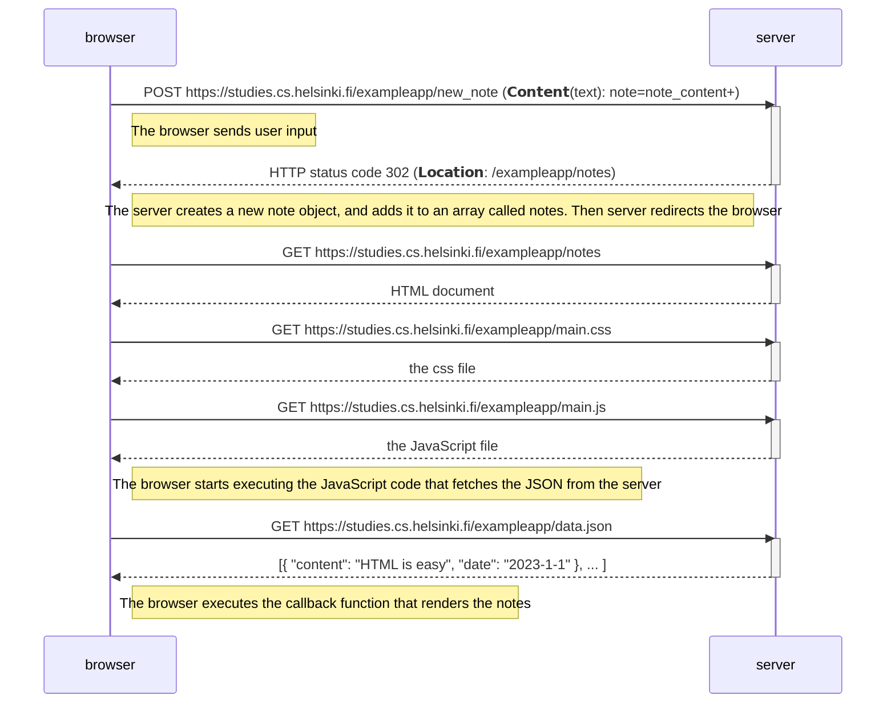

```mermaid
    sequenceDiagram
                
        browser->>server: POST https://studies.cs.helsinki.fi/exampleapp/new_note (𝗖𝗼𝗻𝘁𝗲𝗻𝘁(text): note=note_content+)
        activate server
        Note right of browser: The browser sends user input
        server-->>browser: HTTP status code 302 (𝗟𝗼𝗰𝗮𝘁𝗶𝗼𝗻: /exampleapp/notes)
        deactivate server
        Note left of server: The server creates a new note object, and adds it to an array called notes. Then server redirects the browser
        
        browser->>server: GET https://studies.cs.helsinki.fi/exampleapp/notes
        activate server
        server-->>browser: HTML document
        deactivate server
    
        browser->>server: GET https://studies.cs.helsinki.fi/exampleapp/main.css
        activate server
        server-->>browser: the css file
        deactivate server
    
        browser->>server: GET https://studies.cs.helsinki.fi/exampleapp/main.js
        activate server
        server-->>browser: the JavaScript file
        deactivate server
    
        Note right of browser: The browser starts executing the JavaScript code that fetches the JSON from the server
    
        browser->>server: GET https://studies.cs.helsinki.fi/exampleapp/data.json
        activate server
        server-->>browser: [{ "content": "HTML is easy", "date": "2023-1-1" }, ... ]
        deactivate server
    
        Note right of browser: The browser executes the callback function that renders the notes
                             
```
