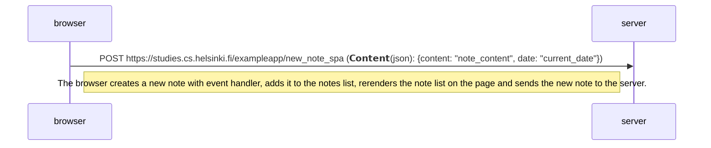

```mermaid
    sequenceDiagram
                
        browser->>server: POST https://studies.cs.helsinki.fi/exampleapp/new_note_spa (𝗖𝗼𝗻𝘁𝗲𝗻𝘁(json): {content: "note_content", date: "current_date"})
        Note right of browser: The browser creates a new note with event handler, adds it to the notes list, rerenders the note list on the page and sends the new note to the server.
                             
```
