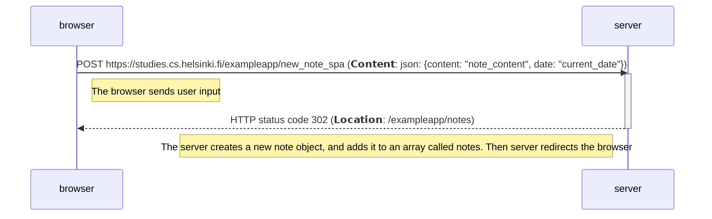

```mermaid
    sequenceDiagram
                
        browser->>server: POST https://studies.cs.helsinki.fi/exampleapp/new_note_spa (𝗖𝗼𝗻𝘁𝗲𝗻𝘁: json: {content: "note_content", date: "current_date"})
        activate server
        Note right of browser: The browser sends user input
        server-->>browser: HTTP status code 302 (𝗟𝗼𝗰𝗮𝘁𝗶𝗼𝗻: /exampleapp/notes)
        deactivate server
        Note left of server: The server creates a new note object, and adds it to an array called notes. Then server redirects the browser
                             
```
